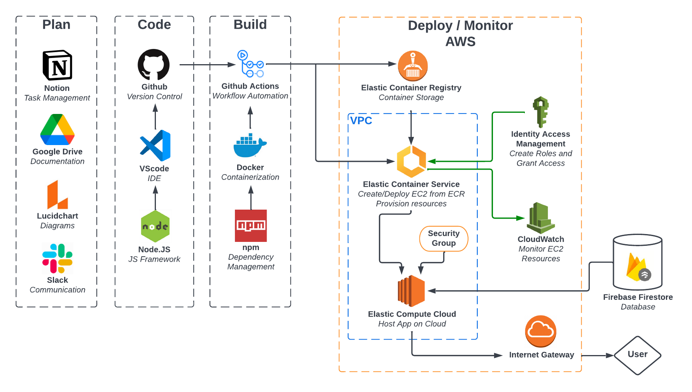

<h1>Cryptek - Cryptocurrency monitoring made easy </h1> 

<p>Cryptek is a web-app designed to facilitate an easily-navigable cryptocurrency monitoring hub. Users can view lists of cryptocurrency assets and associated details without too much visual clutter or overcomplication. Creating a suitable environment for cryptocurrency novices or those who want simple information without needless detail</p>

<h3>App-Story</h3>
https://docs.google.com/document/d/12ve871wYzzY7bPiGktWz_FFFPXAOvJ2jQBCUS0qPt6A/edit?usp=sharing

<h3>Toolchain</h3>
https://docs.google.com/document/d/173VKiQJNX3lcnYz6RxnbJpe36SKXekEk-vPCh3m6EFA/edit?usp=sharing

<h3>Architecture Diagram</h3>



## Deployment

To run this project locally, clone this project, go into the directory, and then run:

```bash
  npm install --force
  npm start
```

For the CI/CD pipeline and web deployment, a Github Action workflow is triggered whenever the following files or directories are modified:

- `public/`
- `src/`
- `package.json`
- `package-lock.json`
- `Dockerfile`

The workflow operates with the following steps:
```
1) The workflow gains programmatic access to AWS services using AWS IAM credentials.
2) The workflow builds a Docker image for the app, then pushes this image to a public repository on AWS Elastic Container Registry (ECR).
3) The ID for the image in the ECR repository is added to an AWS Elastic Container Service (ECS) task definition.
4) The ECS task definition is deployed to an existing ECS cluster and service
```
This causes ECS to run the created task, which in turn deploys an EC2 instance that hosts the app.

The app can be accessed at http://ec2-3-81-115-80.compute-1.amazonaws.com/.
