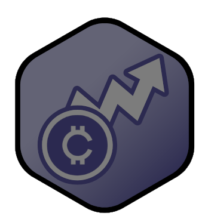
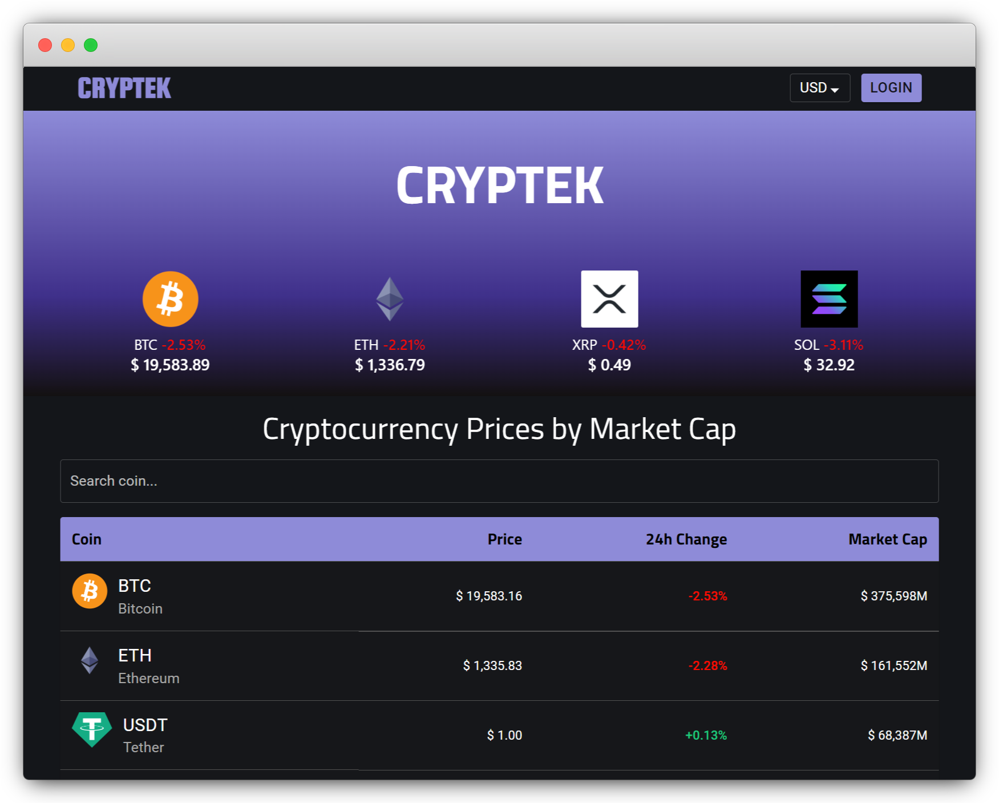

<div id="top"></div>

<!-- PROJECT LOGO -->
<br />
<div align="center">


<h3 align="center">Cryptek</h3>

  <p align="center">Cryptocurrency monitoring made easy.
    <br />
    <a href="https://github.com/strategio-tech/fp-sim4-team-404"><strong>Explore the docs »</strong></a>
    <br />
    <br />
    <a href="http://ec2-3-81-115-80.compute-1.amazonaws.com/">View Demo</a>
    ·
    <a href="https://github.com/strategio-tech/fp-sim4-team-404/issues">Report Bug</a>
    ·
    <a href="https://github.com/strategio-tech/fp-sim4-team-404/issues">Request Feature</a>
  </p>
</div>

<!-- TABLE OF CONTENTS -->

## Table of Contents

  <ol>
    <li>
      <a href="#about-the-project">About The Project</a>
      <ul>
        <li><a href="#features">Features</a></li>
        <li><a href="#architecture-diagram">Architecture Diagram</a></li>
      </ul>
    </li>
    <li><a href="#local-installation">Local Installation</a></li>
    <li><a href="#web-deployment">Web Deployment</a></li> 
	<li><a href="#acknowledgments">Acknowledgments</a></li>
	<li><a href="#authors">Authors</a></li>
  </ol>

<!-- ABOUT THE PROJECT -->

## About The Project



<p>Cryptek is a web application designed to facilitate an easily-navigable cryptocurrency monitoring hub. Users can view lists of cryptocurrency assets and associated details without too much visual clutter or overcomplication. Creating a suitable environment for cryptocurrency novices or those who want simple information without needless detail.</p>

<p align="right">(<a href="#readme-top">back to top</a>)</p>

<!--BUILT WITH -->

## Built With

### Tools

- [CoinGecko - Cryptocurrency API](https://www.coingecko.com/)
- [Amazon Web Services](https://aws.amazon.com/)
  - AWS IAM (Identity Access Management)
  - Amazon ECR (Elastic Container Registry)
  - Amazon ECS (Elastic Container Services)
  - AWS Cloud Watch
- [Firebase](https://firebase.google.com/)
  - Firebase Authentication
  - Firebase Firestore
- [Visual Studio Code](https://code.visualstudio.com/)

### Technologies

- [HTML](https://html.spec.whatwg.org/)
- [CSS](https://www.w3.org/Style/CSS/)
- [JavaScript](https://www.javascript.com/)
- [React.js](https://reactjs.org/)
- [Node.js](https://nodejs.org/en/)
- [npm](https://www.npmjs.com/)
- [Material-UI](https://v4.mui.com/getting-started/installation/)

<p align="right">(<a href="#readme-top">back to top</a>)</p>

<!-- FEATURES -->

## Features

- Allow user(s) to access a list of cryptocurrency assets (in order by price) — (based off the API)

- Allow user(s) to index the list of cryptocurrencies

- Allow user(s) to view details on a selected cryptocurrency

- Allow user(s) to view graphs / charts on a selected cryptocurrency

- Allow user(s) to favorite cryptocurrency assets to a ‘Watchlist’ through local storage

- Allow user(s) to unfavorite cryptocurrency assets

- Allow user(s) to access a web + mobile responsive app

<p align="right">(<a href="#readme-top">back to top</a>)</p>

<!-- ARCHITECTURE DIAGRAM -->

## Architecture Diagram


<p align="right">(<a href="#readme-top">back to top</a>)</p>

<!-- LOCAL INSTALLATION -->

## Local Installation

To run this project locally, the following must be installed:

- [npm](https://docs.npmjs.com/downloading-and-installing-node-js-and-npm#using-a-node-installer-to-install-node-js-and-npm) 8.5.1 or later

- [Node.js](https://docs.npmjs.com/downloading-and-installing-node-js-and-npm#using-a-node-installer-to-install-node-js-and-npm) 16.14.0 or later

First, clone this repository, then go inside the directory:

```

git clone https://github.com/strategio-tech/fp-sim4-team-404.git

cd fp-sim4-team-404

```

Install the dependencies required:

```

npm install --force

```

Finally, start the app:

```

npm start

```

You can then navigate to `localhost:3000` to view the web app.

<p align="right">(<a href="#readme-top">back to top</a>)</p>
  
<!-- WEB DEPLOYMENT -->
## Web Deployment

For the CI/CD pipeline and web deployment, a Github Action workflow is triggered whenever the following files or directories are modified:

- `public/`

- `src/`

- `package.json`

- `package-lock.json`

- `Dockerfile`

For the workflow to run smoothly, the user must do the following steps within an AWS account.

```

1) Create an ECR repository to store your images.

2) Create an ECS task definition, an ECS cluster, and an ECS service.

3) Store your ECS task definition as a JSON file in your GitHub repository.

4) Store an IAM user access key in GitHub Actions secrets named AWS_ACCESS_KEY_ID and AWS_SECRET_ACCESS_KEY.

```

The workflow file must then be modified with the proper variables to function properly. For more information, view the [aws.yml](.github/workflows/aws.yml) file.

Once the workflow is activated, the following steps occur automatically:

```

1) The workflow gains programmatic access to AWS services using AWS IAM credentials.

2) The workflow builds a Docker image for the app.

3) This image is then pushed to a public repository on AWS Elastic Container Registry (ECR).

4) The ID for the image in the ECR repository is added to an AWS Elastic Container Service (ECS) task definition.

5) The ECS task definition is deployed to an existing ECS cluster and service

```

This causes ECS to run the created task, which in turn deploys an EC2 instance that hosts the app.

As an example, the site can be accessed at http://ec2-3-81-115-80.compute-1.amazonaws.com/.

<p align="right">(<a href="#readme-top">back to top</a>)</p>

<!-- ACKNOWLEDGMENTS -->

## Acknowledgments

- [Cryptocurrency Tracker with React JS, Material UI and Chart JS Tutorial](https://www.youtube.com/watch?v=QA6oTpMZp84&ab_channel=RoadsideCoder)
- [Firebase 9 with React JS Tutorial](https://www.youtube.com/watch?v=8NMJxyDwP6A&ab_channel=RoadsideCoder)

<p align="right">(<a href="#readme-top">back to top</a>)</p>

<!-- AUTHORS -->

## Authors

- [@Srmacam](https://github.com/Srmacam)
- [@SLMcCarthy](https://github.com/SLMcCarthy)
- [@GabrielleMWhite](https://github.com/gabriellemwhite)

<p align="right">(<a href="#readme-top">back to top</a>)</p>

<!-- MARKDOWN LINKS & IMAGES -->

[react.js]: https://img.shields.io/badge/React-20232A?style=for-the-badge&logo=react&logoColor=61DAFB
[react-url]: https://reactjs.org/
[html]: https://img.shields.io/badge/HTML5-E34F26?style=for-the-badge&logo=html5&logoColor=61DAFB
[html-url]: https://html.spec.whatwg.org/
[css]: https://img.shields.io/badge/CSS-239120?&style=for-the-badge&logo=css3&logoColor=61DAFB
[css-url]: https://www.w3.org/Style/CSS/
[javascript]: https://img.shields.io/badge/JavaScript-F7DF1E?style=for-the-badge&logo=javascript&logoColor=61DAFB
[javascript-url]: https://www.javascript.com/
[node.js]: https://img.shields.io/static/v1?style=for-the-badge&message=Node.js&color=339933&logo=Node.js&logoColor=FFFFFF
[node.js-url]: https://nodejs.org/en/

`
